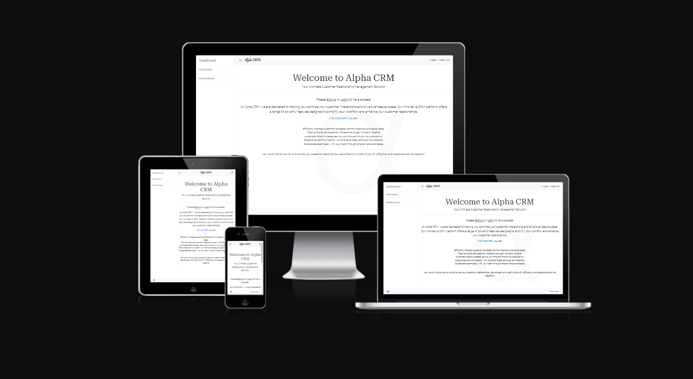

# Alpha CRM

"Alpha CRM" is a customer relationship management (CRM) platform developed using Django, Python, HTML, CSS, and JavaScript.

The system enhances customer interaction by offering tools to create, edit, and organize customer data. Registered users can manage customer information, fostering better engagement and relationship tracking.

Designed with user-friendliness in mind, Alpha CRM employs an agile approach to development, breaking down features into user stories and epics. Security measures like user authentication information integrity.

With its clean design and responsive layout, Alpha CRM simplifies customer management for improved satisfaction and business growth.

[Live Page](https://alpha-crm-c833e9f43a21.herokuapp.com/)

- [Alpha CRM](#alpha-crm)
  - [User Experience (UX)](#user-experience-ux)
    - [User \& Blog Goals](#user--blog-goals)
      - [Targeted User Goals:](#targeted-user-goals)
      - [Site User Goals:](#site-user-goals)
      - [Blog Goals:](#blog-goals)
    - [Agile Methodology](#agile-methodology)
    - [Epics \& User Stories](#epics--user-stories)
  - [Design](#design)
    - [Colour Scheme](#colour-scheme)
    - [Fonts](#fonts)
    - [Imagery](#imagery)
    - [Wireframes](#wireframes)
    - [Database Model](#database-model)
  - [Features](#features)
    - [Future features](#future-features)
  - [Security Features \& Defensive Design](#security-features--defensive-design)
      - [User Authentication](#user-authentication)
      - [Form Validation](#form-validation)
      - [Database Security](#database-security)
      - [Custom Error Page](#custom-error-page)
  - [Technologies Used](#technologies-used)
    - [Languages Used](#languages-used)
    - [Django](#django)
    - [Frameworks, Libraries \& Programs Used](#frameworks-libraries--programs-used)
  - [Testing](#testing)
  - [Deployment](#deployment)
    - [Create the live database which can be accessed by Heroku:](#create-the-live-database-which-can-be-accessed-by-heroku)
    - [Heroku app setup:](#heroku-app-setup)
    - [Prepare env.py and settings.py files](#prepare-envpy-and-settingspy-files)
    - [Create files / directories](#create-files--directories)
    - [Update Heroku Config Vars](#update-heroku-config-vars)
    - [Deploy](#deploy)
    - [Local Deployment](#local-deployment)
      - [How to Clone](#how-to-clone)
      - [How to Fork](#how-to-fork)
    - [Remote Deployment](#remote-deployment)
  - [Credits](#credits)
    - [Code](#code)
    - [Acknowledgements](#acknowledgements)

- - -

## User Experience (UX)

### User & Blog Goals

#### Targeted User Goals:
* Businesses looking for a robust CRM solution.
* Companies needing to organize and track customer interactions.
* Organizations that want to improve customer communication.

#### Site User Goals:
* For users to be able to interact with the CRM intuitively.
* For users to be able to access and manage customer data efficiently.
* For users to be able to schedule and track customer interactions with ease.
* For registered users to be able to securely log in and log out of their accounts.
* For registered users to be able to add comments and updates on customer profiles.
* For registered users to be able to add, edit, and delete customer data as needed.

#### Site Goals:
* Provide an intuitive and user-friendly interface for seamless interaction.
* Ensure efficient data management and visualization of customer information.
* Create responsive design to offer consistent user experience across devices.
* Provide registered users the access to comment and manage customers with full CRUD functionality.

### Agile Methodology

The agile planning approach was employed in the development of this site, wherein each user feature was broken down into individual user stories, each accompanied by specific acceptance criteria. These criteria were then translated into tasks, serving as markers of completion for the respective user stories.

To enhance functionality, interconnected user stories that contributed to specific site features were grouped into broader Epics. User stories were categorized as Must Have, Should Have, or Could Have, aiding in prioritization during the implementation process.

As the site evolved, tasks were refined or adapted based on changing user needs and a more mature understanding of project requirements. GitHub Issues and the Kanban board within the GitHub Projects view served as the structural framework. The project was organized into several sections:

* To Do - Serving as the initial repository for all user stories.
* In Progress - Active development stories were tracked in this phase.
* Done - Successfully developed stories found their place here.
* Future - This section was reserved for 'could have' stories containing features earmarked for potential implementation at a later stage due to time limitations.

Feel free to explore the Kanban Board for a visual representation of the user stories [here](https://github.com/users/Freedy-FR/projects/5/views/1).

### Epics & User Stories

**Epic 1: Website UI Features**

User Story #1

View Customer List (Must Have) - As a Site User, I want to view a list of customers so that I can select one to read.

Acceptance Criteria:
* As a site user, I can see a comprehensive list of customers.
* Each customer's name is clearly visible and clickable.

User Story #2

Site pagination (must have) - As a Site User, I want to be able to view a paginated list of customers, so that I can easily select a customer to view their details.

Acceptance Criteria:
* As a site user, I can view a maximum of 10 customers per page.
* As a site user, I can navigate efficiently through the customer list using pagination controls.
* As a site user, I can click on a customer's name to be directed to their detailed information page

User Story #3

View Instructions (Should have) - As a Site User, I want to access instructions that guide me on how to effectively operate within the CRM.

Acceptance Criteria:
* As a site user, I can access clear and concise instructions from a prominent location.
* As a site user, I can find instructions covering key functionalities and processes within the CRM.
* As a site user, I can use these instructions to understand tasks such as adding, editing, and deleting customers.

User Story #4

Open Customer Details (Must Have) - As a Site User, I want to click on a customer's name to open their detailed page, enabling me to read all relevant information.

Acceptance Criteria:
* As a site user, I can click on a customer's row in the list to access their dedicated details page.
* As a site user, I can expect to find comprehensive information about the selected customer on their details page.

User Story #5

View Images (Should Have) - As a Site User, I want to view images of customers on each customer's details page, enhancing my familiarity with them.

Acceptance Criteria:
* As a site user, I can see images of customers or their company logos on the customer's details page.
* As a site user, I can utilize these images to visually identify customers and recognize their affiliations.

User Story #6

Side Nav Collapse (Could Have) - As a Site User, I want the option to collapse the navigation bar to maximize the space available for viewing the customer list.

Acceptance Criteria:
* As a site user, I can access a feature that allows me to collapse the navigation bar.
* Toggling the navigation bar enhances the space available for displaying the customer list.

User Story #7

Dark/Light Theme (Could Have) - As a Site User, I want the ability to switch between dark and light themes to optimize site visibility under varying lighting conditions.

Acceptance Criteria:
* As a site user, I can easily select between dark and light themes from the site interface.
* The chosen theme results in a visually comfortable experience according to the lighting conditions.

**Epic 2: Registration & Account Features**

User Story #8

Account Registration (Must Have) - As a Site User, I want the ability to register an account, allowing me to engage by commenting, adding, and editing customer information.

Acceptance Criteria:
* As a site user, I can complete the registration process smoothly by providing essential details.
* After registering, I can securely log in with my credentials to access additional functionalities.

User Story #9

Login & Logout (Must Have) - As a Site User, I want the ability to log in and out of the site securely, granting me access to my account.

Acceptance Criteria:
* As a site user, I can utilize a user-friendly login interface to log in and out securely.
* After logging in, I can access features that are specific to registered users.
* Logging out ensures the protection and security of my account.

User Story #10

View Comments (Must Have) - As a Site User, I want to view comments on individual customers, providing insights into any specific aspects or interactions.

Acceptance Criteria:
* As a site user, I can see comments left by other users on the customer's details page.
* As a site user, I can conveniently read and comprehend the organized comments.

User Story #11

Comment on a Customer (Must Have) - As a Site User, I want to leave comments on a customer's profile, enabling me to include relevant notes and information.

Acceptance Criteria: 
* As a site user, I can find a dedicated comment section on the customer's details page.
* I have the capability to write and submit comments, which are then displayed alongside my username.

User Story #12

Add a customer (must have) - As a Site User, I want to add a customer to update the customer list.

Acceptance Criteria: 
* As a site user, I can complete a user-friendly form to input customer details.
* As a site user, I can submit the form, and the submitted information is accurately added to the customer list.

User Story #13

Edit a Customer (Must Have) - As a Site User, I want to edit a customer's information to keep the list up to date.

Acceptance Criteria: 
* As a site user, I can access editing options from the customer details page.
* As a site user, I can edit customer information, and the edited details are saved correctly in the customer list.

User Story #14

Delete a Customer (Must Have) - As a Site User, I want to delete a customer to maintain an accurate customer list.

Acceptance Criteria: 
* As a site user, I can access a delete option on the customer details page.
* As a site user, I can delete a customer, and the customer is removed from the list accurately.

**Epic 3: Blog Features**

User Story #15

Manage Comments (Must Have) - As a Site Admin, I want to have the capability to create, read, and delete comments, allowing effective management of customer-related comments.

Acceptance Criteria: 
* As a site user, I can access admin-specific controls that enable me to create, read, and delete comments.

User Story #16

Manage Customers (Must Have) - As a Site Admin, I want the authority to create, read, update, and delete customer information from the admin panel.

Acceptance Criteria:
* As a Site Admin, I can perform CRUD operations on customer records through admin controls.

User Story #17

Approve Comments (Could Have) - As a Site Admin, I want the ability to approve or disapprove comments, ensuring that objectionable content is filtered out.

Acceptance Criteria:
* As a Site Admin, I can review comments before they are displayed to others.

- - -

## Design

A bootstrap template was used to help format the core blog website. Custom css styling and html was also used.

* [Bootstrap template](https://startbootstrap.com/template/blog-home)

### Colour Scheme

The colour scheme was taken from [Coolors](https://coolors.co/). 

It was based on the image used for the [Favicon icon](https://www.pngall.com/) which I.

The use of these colours have been consistently maintained throughout the website and checked for contrast to allow easy accessibility.

### Fonts

[Google Fonts](https://fonts.google.com/) were used as below:

*  is used for the title.
*  is used for the body of the text. 
*  is present as backup.

### Imagery

<!-- Images used were warm or colourful to fit the theme and intention of the website, which is about love of baking & sharing recipes to engage users to want to make themselves.  -->

Hero image and placeholder featured image for post was taken from [Pexels](https://www.pexels.com/), the Favicon icon from [PNG All](https://www.pngall.com/).

### Wireframes

Wireframes were created for desktop/laptop, tablet and mobile.

Home

Login

### Database Model

Principles of object-oriented programming was used throughout this project and Django’s class-based generic views. Django AllAuth was used for user authentication.

Observations model was followed from walkthrough project.

A custom database model was developed for customers.

The custom model was made to incorporate CRUD functionality. This allows registered users and admin to add, edit or delete customers, both from the live site and from the Django database via the Django admin page.

- - -

## Features
Below are the main features the user will come across 

1. Favicon logo is displayed for the blog.

 
2. Navbar is present at the top of every page and includes all links to the other pages. Hovering over the link changes the colour from XXXX  to XXXX.

1. When a user is logged in, the title changes to the user's name with a profile icon 

4. The navbar is fully responsive and collapses into a hamburger menu icon on smaller screen sizes. When the hamburger is clicked, the menu options open on the left-hand side.

5. The footer section includes working dark/light themes.

6. Home page has an about me feature to describe the dev and then general purpose related to the site for user to read.

7. Instruction page will try to give the user some knowledge and general advice related to using the CRM site.

8. Logged in user can add in a observations using the leave observations form which is subject to approval for screening by admin before this is displayed.
   

<!-- 9. From a post a logged in user has the ability to like or comment on posts where the count next to the respective icons will be displayed. This functionality is present for blog and recipe posts.

 -->

10. There is an option to return home page from the individual customers. 

<!-- 11.  There is a comment prompt to user to sign up or login (links in place) if they want to engage with the post.

 -->

<!-- 12. Recipe posts have CRUD functionality from the recipe post you are able to edit or delete the recipe if you are the author.

 -->

13. The update customer feature appears with fields pre-filled in and the author can then change and update the customer information.

14.  The delete customer feature will have a message to confirm the uses wants to delete.

<!-- 15. User page is accessible once logged in. This is where the user is able to add recipes.

 -->

<!-- 16. Add recipe form has fields to help guide the user on how to format and some required fields to help post a well rounded recipe.

 -->

<!-- 17. There is a sign up form for users to register an account. There is also a prompt for those who have an account to login (link in place).

 -->

<!-- 18. A user who has an account can log in. There is a prompt if the user doesn't have an account to go signup first (link in place). Again there is a message to reiterate access to liking and commenting once logged in.

 -->

<!-- 19. A user who has an logged in can log out. There is a message to confirm if the uses wishes to log out which the user has to click the button to confirm.

 -->

<!-- 20. Consistent formatting with hero image and tagline throughout the site to confirm blog purpose.

 -->

### Future features
<!-- * From the user page the user will be able to view all their recipes and likes easily in one place so that they can see their activity on the site.
* As the blog grows it would be ideal to implement a search bar so the user can easily find what they are looking for.
* As the blog grows, update the recipe model to include catergories and have all recipes classified and accessible from the main site by these categories. -->

- - -

## Security Features & Defensive Design

I have tried to use defensive programming throughout the site to prevent users accessing pages, submitting requests if they don't have the relevant permissions. 

#### User Authentication

* Django's LoginRequiredMixin is used to ensure that any requests to access secure pages by non-authenticated or, in some cases, non-admin users, are immediatley redirected to the login page.

* Django's UserPassesTestMixin is used to check any number of conditions and will deny a request with a permission error if the test_func() method returns false. As such the user is authenticated before the request is completed.

* Check for authenticated users in templates by using the if statement i.e. , before allowing access (adding comments) or visibility to links (user page).

#### Form Validation

* Messages are present for fields forms where validation is required. If a user attempts to sign up or login without completing the relevant fields a message is displayed. User will not be able to sign in or login until all relevant fields are filled in.

* Similary when submitting a customer if the required fields are not filled in then the user will be directed to the empty required field. This will not submit until all required fields are completed.

!!!IMPORTANT >>>>>>>>>>>>>>>>

See [TESTING.md](https://github.com/Sarohia94/Project-4-Baking-Blog/blob/main/TESTING.md) document.

#### Database Security

The database url and secret key are stored in the env.py file to prevent unwanted connections to the database. The env.py file was created before the initial push to GitHub.

Cross-Site Request Forgery (CSRF) tokens were used on all forms throughout this site.

#### Custom Error Page

This was created following a tutorial (linked in the credits) for when a user is trying to access a customer to delete it. This will give the user some information on the error and give them a link to return home.

* 403 Unauthorized Access - You're not authorized to perform this action

See [TESTING.md](https://github.com/Sarohia94/Project-4-Baking-Blog/blob/main/TESTING.md) document.

- - -

## Technologies Used

### Languages Used

HTML, CSS, Javascript and Python.

### Django 
* Gunicorn - as the server for Heroku.
* Cloudinary - to host the static files and media for the site.
* Dj_database_url - to parse the database URL from the environment variables in Heroku.
* Psycopg2 - as an adaptor for Python and PostgreSQL databases.
* Summernote - as a text editor.
* Allauth - for authentication, registration, account management.
* Crispy forms - provides a tag and filter that lets you quickly render forms
* Autoslug - improved slug field which can automatically populate itself from another field and preserve uniqueness of the value.

### Frameworks, Libraries & Programs Used
* [Am I responsive?](https://ui.dev/amiresponsive) - to show game across a range of devices.
* Git - for version control. 
* GitHub - to save and store the code pushed from Git.
* GitPod - using GitPod terminal to commit to Git and push to GitHub.
* Balsamic - to create the wireframes when designing the website.
* Dev Tools - for testing and troubleshooting.
* [Google Fonts](https://fonts.google.com/) - to import font to apply on the website.
* [Font Awesome](https://fontawesome.com/) - to add icons.
* [Wave](https://wave.webaim.org/) - to test web accessibility.
* [W3C](https://validator.w3.org/) - HTML validator.
* [Jigsaw](https://jigsaw.w3.org/css-validator/) - CSS validator.
* [Tiny PNG](https://tinypng.com/) - to compress images.
* [Responsive design checker](https://responsivedesignchecker.com/) - to check responsive design for a variety of screen sizes.
* [Favicon.io](https://favicon.io/favicon-generator/) - to creat favicon icon for the website.
* Django - a high-level Python web framework that encourages rapid development
* Bootstrap - a framework for building responsive, mobile-first sites.
* Heroku - used to deploy the live project.
* PostgreSQL - database used through heroku.

- - -

## Testing 

Details of all testing done can be viewed in depth in the [TESTING.md](https://github.com/Sarohia94/Project-4-Baking-Blog/blob/main/TESTING.md) document.

- - -

## Deployment 

The project is deployed using Heroku.

### Create the live database which can be accessed by Heroku:

1. Go to the ElephantSQL dashboard and click the create new instance button on the top right.
2. Name the plan (i.e. your project name), select the tiny turtle plan (which is the free plan) and choose the region that is closest to you then click the review button.
3. Check the details are all correct and then click create instance in the bottom right.
4. Go to the dashboard and select the database just created.
5. Copy the URL.

### Heroku app setup:

1. From the Heroku dashboard, click the new button in the top right corner and select create new app.
2. Give your app a unique name, select the region that is closest to you and then click the create app button bottom left.
3. Open the settings tab and create a new config var of DATABASE_URL and paste the database URL you copied from elephantSQL into the value (remove quotation marks from value).

### Prepare env.py and settings.py files

1. In your GitPod workspace, create an env.py file in the main directory and add the DATABASE_URL value and your chosen SECRET_KEY value to the file.
3. Update the settings.py file to import the env.py file and add the SECRETKEY and DATABASE_URL file paths.
4. Comment out default database configuration then save all files and make migrations.
5. Add the Cloudinary URL to env.py and the Cloudinary libraries to the list of installed apps.
6. Add the STATIC files settings
7. Link the file to the templates directory in Heroku.
8. Change the templates directory to TEMPLATES_DIR
9. Add Heroku to the ALLOWED_HOSTS list the format ['app_name.heroku.com', 'localhost']

### Create files / directories
1. Create a requirements.txt file
2. Create directories in the main directory
3. Create a "Procfile" in the main directory and add the following: web: gunicorn project_name.wsgi

### Update Heroku Config Vars
Add the following Config Vars in Heroku:
* SECRET_KEY = value
* CLOUDINARY_URL = URL
* PORT = 8000
* DISABLE_COLLECTSTATIC = 1
* HEROKU_POSTGRESQL_OLIVE_URL = URL
* DATABASE_URL = URL

### Deploy

1. Make sure DEBUG = int(os.environ.get("DEVELOPMENT", default=0)) in the settings.py
2. Remove config vars DISABLE_COLLECTSTATIC = 1 from Heroku settings.
3. Go to the deploy tab on Heroku and connect to GitHub, then to the required repository.
4. Remove config vars DISABLE_COLLECTSTATIC = 1 from Heroku settings.
5. Scroll to the bottom of the deploy page and either click Enable Automatic Deploys for automatic deploys or Deploy Branch to deploy manually. Please note, manually deployed branches will need re-deploying each time the GitHub repository is updated.
6. Click 'Open App' to view the deployed live site.

The site is now live and operational.

### Local Deployment

#### How to Clone
1. Sign up or log in to GitHub
2. Go to the repository https://github.com/Sarohia94/Project-4-Baking-Blog
3. Go to the code dropdown and select how you'd like clone and copy the link provided
4. Go to the new repo and enter in your workspace terminal, "git clone" (without quotes) followed by the link copied
5. Install necessary libraries/frameworks to the terminal 
6. Enter the following command "pip3 freeze > requirements.txt" (without quotes) to the terminal to install the libraries/frameworks dependencies which will be required if this is deployed to Heroku
7. Enter command "python3 manage.py runserver run.py" (without quotes) to run the browser.

#### How to Fork
1. Sign up or log in to GitHub
2. Go to the repository 
3. Click on the fork button towards the top right of the page 

### Remote Deployment
The website was deployed to GitHub Pages as follows:
1. Log in to GitHub
2. Assuming you have cloned or forked the repository, go on the "Settings" link for this repository
3. Click on the "Pages" link on the left hand side of the page
4. Under "Source" select "Deploy from branch" from the dropdown
5. Under "Branch" select "main" from the dropdown
6. Click "Save" which will then refresh the page
7. It might take a few mins before you can refresh and view the link to the site published

- - -

## Credits

### Code

For general guidance and trouble shooting:
* W3Schools
* Django Docs
* [Bootstrap Docs](https://getbootstrap.com/docs/5.2/getting-started/introduction/)
* Stack Overflow
* Code Institute - Blog Walkthrough Project
* Youtube videos by Codemy

* [Bootstrap template](https://startbootstrap.com/template/) - for general layout and design.
* [Django CRM Tutorial](https://www.youtube.com/) - used as a guide to implement CRUD functionality

Images creditted as follows:
* Images from home blog posts as well as hero image taken from [Pexels](https://www.pexels.com/)

### Acknowledgements 
Thank you to anyone taking the time to view my fourth project. Special thanks to the Slack community and the below individuals:
* [Placeholder Mentor](https://github.com/), my mentor. Thank you for your guidance and feedback.
* To the tutors from tutor support for their help and assistance:    