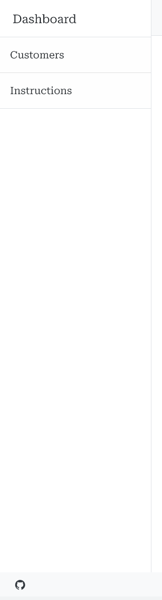
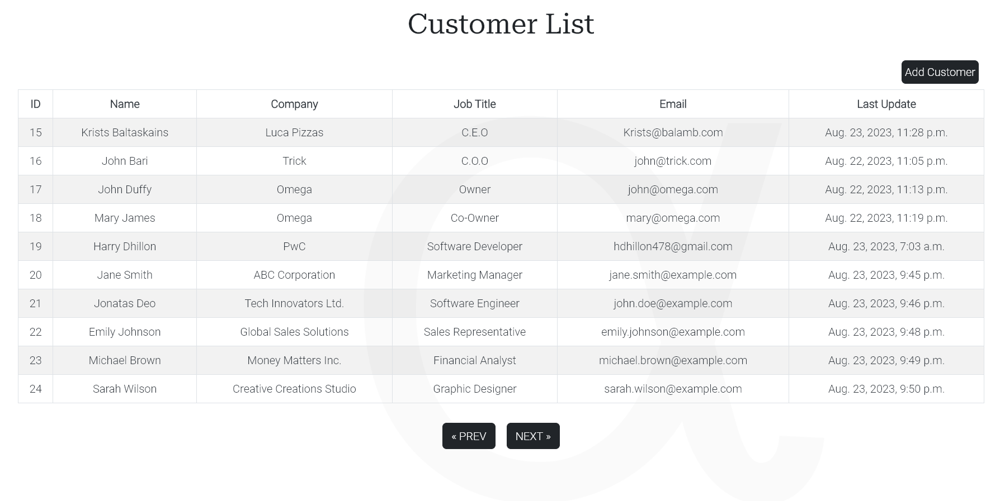

<base target="_blank">

# Alpha CRM

"Alpha CRM" is a customer relationship management (CRM) platform developed using Django, Python, HTML, CSS, and JavaScript.

The system enhances customer interaction by offering tools to create, edit, and organize customer data. Registered users can manage customer information, fostering better engagement and relationship tracking.

Designed with user-friendliness in mind, Alpha CRM employs an agile approach to development, breaking down features into user stories and epics. Security measures like user authentication information integrity.

With its clean design and responsive layout, Alpha CRM simplifies customer management for improved satisfaction and business growth.

[Live Page](https://alpha-crm-c833e9f43a21.herokuapp.com/)

- [Alpha CRM](#alpha-crm)
  - [User Experience (UX)](#user-experience-ux)
    - [User & Blog Goals](#user--blog-goals)
      - [Targeted User Goals:](#targeted-user-goals)
      - [Site User Goals:](#site-user-goals)
      - [Blog Goals:](#blog-goals)
    - [Agile Methodology](#agile-methodology)
    - [Epics & User Stories](#epics--user-stories)
  - [Design](#design)
    - [Colour Scheme](#colour-scheme)
    - [Fonts](#fonts)
    - [Imagery](#imagery)
    - [Wireframes](#wireframes)
    - [Database Model](#database-model)
  - [Features](#features)
    - [Future features](#future-features)
  - [Security Features & Defensive Design](#security-features--defensive-design)
    - [User Authentication](#user-authentication)
    - [Form Validation](#form-validation)
    - [Database Security](#database-security)
    - [Custom Error Page](#custom-error-page)
  - [Technologies Used](#technologies-used)
    - [Languages Used](#languages-used)
    - [Django](#django)
    - [Frameworks, Libraries & Programs Used](#frameworks-libraries--programs-used)
  - [Testing](#testing)
  - [Deployment](#deployment)
    - [Create the live database which can be accessed by Heroku:](#create-the-live-database-which-can-be-accessed-by-heroku)
    - [Heroku app setup:](#heroku-app-setup)
    - [Prepare env.py and settings.py files](#prepare-envpy-and-settingspy-files)
    - [Create files / directories](#create-files--directories)
    - [Update Heroku Config Vars](#update-heroku-config-vars)
    - [Deploy](#deploy)
    - [Local Deployment](#local-deployment)
      - [How to Clone](#how-to-clone)
      - [How to Fork](#how-to-fork)
  - [Credits](#credits)
    - [Code](#code)
    - [Acknowledgements](#acknowledgements)

- - -

## User Experience (UX)

### User & Blog Goals

#### Targeted User Goals:
* Businesses looking for a robust CRM solution.
* Companies needing to organize and track customer interactions.
* Organizations that want to improve customer communication.

#### Site User Goals:
* For users to be able to interact with the CRM intuitively.
* For users to be able to access and manage customer data efficiently.
* For users to be able to schedule and track customer interactions with ease.
* For registered users to be able to securely log in and log out of their accounts.
* For registered users to be able to add comments and updates on customer profiles.
* For registered users to be able to add, edit, and delete customer data as needed.

#### Site Goals:
* Provide an intuitive and user-friendly interface for seamless interaction.
* Ensure efficient data management and visualization of customer information.
* Create responsive design to offer consistent user experience across devices.
* Provide registered users the access to comment and manage customers with full CRUD functionality.

### Agile Methodology

The agile planning approach was employed in the development of this site, wherein each user feature was broken down into individual user stories, each accompanied by specific acceptance criteria. These criteria were then translated into tasks, serving as markers of completion for the respective user stories.

To enhance functionality, interconnected user stories that contributed to specific site features were grouped into broader Epics. User stories were categorized as Must Have, Should Have, or Could Have, aiding in prioritization during the implementation process.

As the site evolved, tasks were refined or adapted based on changing user needs and a more mature understanding of project requirements. GitHub Issues and the Kanban board within the GitHub Projects view served as the structural framework. The project was organized into several sections:

* To Do - Serving as the initial repository for all user stories.
* In Progress - Active development stories were tracked in this phase.
* Done - Successfully developed stories found their place here.
* Future - This section was reserved for 'could have' stories containing features earmarked for potential implementation at a later stage due to time limitations.

Feel free to explore the Kanban Board for a visual representation of the user stories [here](https://github.com/users/Freedy-FR/projects/5/views/1).

### Epics & User Stories

**Epic 1: Website UI Features**

User Story #1

View Customer List (Must Have) - As a Site User, I want to view a list of customers so that I can select one to read.

Acceptance Criteria:
* As a site user, I can see a comprehensive list of customers.
* Each customer's name is clearly visible and clickable.

User Story #2

Site pagination (must have) - As a Site User, I want to be able to view a paginated list of customers, so that I can easily select a customer to view their details.

Acceptance Criteria:
* As a site user, I can view a maximum of 10 customers per page.
* As a site user, I can navigate efficiently through the customer list using pagination controls.
* As a site user, I can click on a customer's name to be directed to their detailed information page

User Story #3

View Instructions (Should have) - As a Site User, I want to access instructions that guide me on how to effectively operate within the CRM.

Acceptance Criteria:
* As a site user, I can access clear and concise instructions from a prominent location.
* As a site user, I can find instructions covering key functionalities and processes within the CRM.
* As a site user, I can use these instructions to understand tasks such as adding, editing, and deleting customers.

User Story #4

Open Customer Details (Must Have) - As a Site User, I want to click on a customer's name to open their detailed page, enabling me to read all relevant information.

Acceptance Criteria:
* As a site user, I can click on a customer's row in the list to access their dedicated details page.
* As a site user, I can expect to find comprehensive information about the selected customer on their details page.

User Story #5

View Images (Should Have) - As a Site User, I want to view images of customers on each customer's details page, enhancing my familiarity with them.

Acceptance Criteria:
* As a site user, I can see images of customers or their company logos on the customer's details page.
* As a site user, I can utilize these images to visually identify customers and recognize their affiliations.

User Story #6

Side Nav Collapse (Could Have) - As a Site User, I want the option to collapse the navigation bar to maximize the space available for viewing the customer list.

Acceptance Criteria:
* As a site user, I can access a feature that allows me to collapse the navigation bar.
* Toggling the navigation bar enhances the space available for displaying the customer list.

User Story #7

Dark/Light Theme (Could Have) - As a Site User, I want the ability to switch between dark and light themes to optimize site visibility under varying lighting conditions.

Acceptance Criteria:
* As a site user, I can easily select between dark and light themes from the site interface.
* The chosen theme results in a visually comfortable experience according to the lighting conditions.

**Epic 2: Registration & Account Features**

User Story #8

Account Registration (Must Have) - As a Site User, I want the ability to register an account, allowing me to engage by commenting, adding, and editing customer information.

Acceptance Criteria:
* As a site user, I can complete the registration process smoothly by providing essential details.
* After registering, I can securely log in with my credentials to access additional functionalities.

User Story #9

Login & Logout (Must Have) - As a Site User, I want the ability to log in and out of the site securely, granting me access to my account.

Acceptance Criteria:
* As a site user, I can utilize a user-friendly login interface to log in and out securely.
* After logging in, I can access features that are specific to registered users.
* Logging out ensures the protection and security of my account.

User Story #10

View Comments (Must Have) - As a Site User, I want to view comments on individual customers, providing insights into any specific aspects or interactions.

Acceptance Criteria:
* As a site user, I can see comments left by other users on the customer's details page.
* As a site user, I can conveniently read and comprehend the organized comments.

User Story #11

Comment on a Customer (Must Have) - As a Site User, I want to leave comments on a customer's profile, enabling me to include relevant notes and information.

Acceptance Criteria: 
* As a site user, I can find a dedicated comment section on the customer's details page.
* I have the capability to write and submit comments, which are then displayed alongside my username.

User Story #12

Add a customer (must have) - As a Site User, I want to add a customer to update the customer list.

Acceptance Criteria: 
* As a site user, I can complete a user-friendly form to input customer details.
* As a site user, I can submit the form, and the submitted information is accurately added to the customer list.

User Story #13

Edit a Customer (Must Have) - As a Site User, I want to edit a customer's information to keep the list up to date.

Acceptance Criteria: 
* As a site user, I can access editing options from the customer details page.
* As a site user, I can edit customer information, and the edited details are saved correctly in the customer list.

User Story #14

Delete a Customer (Must Have) - As a Site User, I want to delete a customer to maintain an accurate customer list.

Acceptance Criteria: 
* As a site user, I can access a delete option on the customer details page.
* As a site user, I can delete a customer, and the customer is removed from the list accurately.

**Epic 3: Blog Features**

User Story #15

Manage Comments (Must Have) - As a Site Admin, I want to have the capability to create, read, and delete comments, allowing effective management of customer-related comments.

Acceptance Criteria: 
* As a site user, I can access admin-specific controls that enable me to create, read, and delete comments.

User Story #16

Manage Customers (Must Have) - As a Site Admin, I want the authority to create, read, update, and delete customer information from the admin panel.

Acceptance Criteria:
* As a Site Admin, I can perform CRUD operations on customer records through admin controls.

User Story #17

Approve Comments (Could Have) - As a Site Admin, I want the ability to approve or disapprove comments, ensuring that objectionable content is filtered out.

Acceptance Criteria:
* As a Site Admin, I can review comments before they are displayed to others.

- - -

## Design

A bootstrap template was employed to aid in structuring the foundational design of the blog website. Additionally, custom CSS styling and HTML were utilized to further enhance its appearance and layout.

* [Bootstrap template](https://startbootstrap.com/template/simple-sidebar)

### Colour Scheme

The colour scheme was taken from [Coolors](https://coolors.co/). 

The design of the website draws inspiration from the classic and organized layout of a newspaper. This choice was made to provide a structured and easy-to-navigate platform for users to access information.

The use of these colours have been consistently maintained throughout the website and checked for contrast to allow easy accessibility.

Colour palette

 

### Fonts

[Google Fonts](https://fonts.google.com/) were used as below:

* Roboto Serif is used for the title.
* Roboto is used for the body of the text. 
* Pacifico is used for the Logo.

### Imagery

The website focuses on a clean, efficient design. It uses a background image for aesthetics and performance. This maintains tidiness and quick loading while avoiding image clutter.

The background image and placeholder profile images for customers were sourced from [Pexels](https://www.pexels.com/), while the Favicon icon was obtained from [Favicon](https://favicon.io/).

### Wireframes

Wireframes were created for desktop/laptop, tablet and mobile.

Home

Home Register

Home Logged In

Customer List

Customer Create

Customer Detail

Customer Delete

Customer Update

### Database Model

Principles of object-oriented programming have been consistently applied throughout the development of this project, particularly leveraging Django's class-based generic views. To ensure secure and seamless user authentication, the project integrates Django AllAuth.

For the Observations model, the project followed the structure and concepts established in the provided walkthrough project, aligning with best practices.

A custom database model was specifically designed to cater to the unique requirements of managing customer information. The database model, illustrated below, encompasses various fields including professional details of customers. The integration of the CloudinaryField enables efficient handling of profile pictures.

The custom model has been meticulously crafted to encompass comprehensive CRUD (Create, Read, Update, Delete) functionality. This empowers both registered users and administrators to seamlessly perform actions such as adding, editing, or removing customer records. These operations can be executed both on the live site and via Django's intuitive admin page, providing a versatile and user-friendly experience.

- - -

## Features
Below are the main features the user will come across.

1. Favicon logo is displayed for the site.

Favicon

 

 
2. The navbar is present at the top of every page and includes links to Login, Signup, Homepage at Logo and toggle button for sidebar.

Navbar

 

3. When a user is logged in, the navigation bar transforms into a Logout link, displaying the user's name alongside a badge icon.

Logged in

 

4. The navbar is fully responsive and collapses into a hamburger menu icon on smaller screen sizes. When the hamburger is clicked, the menu options open on the center of the screen.

Hamburger

 

5. The footer contains links for an 'About Me' section describing the developer, site-related information, and a link to the developer's GitHub profile.

Footer

 

6. The sidebar features quick access links to the customer list and instruction page, enhancing user navigation within the site.

Sidebar

 

7. The instruction page aims to provide users with knowledge and general advice on using the site.

Instruction

 

8. Logged in user can add in comments using the comments section on the customer details page.
   

Comments

 

9. There is an option to return from the customer details and customer update pages. 

Back Detail

 

Back Update

 

10. Customer details page have CRUD functionality users are able to update or delete the customer if they are logged in.

CRUD

 

11. The Update Customer functionality displays pre-filled fields, allowing users to modify and update customer information as needed.

Update Form

 

12. The Delete Customer feature incorporates a modal message to confirm whether the user intends to proceed with the deletion.

Delete Modal

 

13. The Customer List page displays a comprehensive list containing essential information about each customer.

Customer List

 

14. The Customer List includes a pagination feature that enables users to view a maximum of ten customers per page.

Pagination

 

15. The Main Page provides a user registration link for account sign-up, and there's a convenient login prompt for existing users (with a link).

Main Page

 

16. After logging in, the Main Page transforms into a personalized Welcome Page for the user.

Welcome Page

 

17. The customer detail page displays comprehensive information, including a profile picture or a placeholder if no picture is available.

Customer Detail

 

### Future features
* From the footer, users can easily switch between light and dark themes for a personalized viewing experience.
* In the future, it will be essential to develop a user interface for administrators to either approve or delete comments.
* In the future stages of development, it will be essential to implement further validation mechanisms to ensure the accuracy and completeness of the form fields.
* In the future, we'll need to implement customer groups, like "read-only" and "update and read," to control user access. This way, different users will have the right permissions based on their roles.

- - -

## Security Features & Defensive Design

I've applied defensive programming principles across the site to ensure that users without the necessary permissions are prevented from accessing certain pages or submitting requests. This helps maintain the integrity of the application's functionality and user experience.

#### User Authentication

* Django's login_required decorator is used to ensure that any requests to access secure pages by non-authenticated or, in some cases, non-admin users, are immediatley redirected to the login page.

* Verify the user's authentication status within templates using conditional statements, such as . This step ensures controlled access, like enabling comments or displaying links on the user page, based on the user's authentication status.

#### Form Validation

* Messages are displayed for form fields requiring validation. When a user tries to sign up or log in without completing required fields, a message appears. Users cannot sign in or log in until all necessary fields are appropriately filled.

* Likewise, when submitting customer information, if the obligatory fields are left unfilled, the user will be directed to fill in those required fields. The submission will not proceed until all necessary fields have been completed.

See [TESTING.md](https://github.com/Freedy-FR/CI-P4-AlphaCRM/blob/main/TESTING.md) document.

#### Database Security

To prevent unauthorized access to the database, the database URL and secret key are stored in the "env.py" file. This file was established prior to the initial GitHub push.

To enhance security, Cross-Site Request Forgery (CSRF) tokens have been implemented in all forms across the site.

#### Custom Error Page

The approach for handling 404 errors was adopted from a tutorial (referenced in the credits section). When a user attempts to access a customer page that doesn't exist, this custom 404 page will provide the user with informative error details along with a link to navigate back to the home page.

404 page

 

- - -

## Technologies Used

### Languages Used

HTML, CSS, Javascript and Python.

### Django 
* Gunicorn - as the server for Heroku.
* Cloudinary - to host the static files and media for the site.
* Dj_database_url - to parse the database URL from the environment variables in Heroku.
* Psycopg2 - as an adaptor for Python and PostgreSQL databases.
* Allauth - for authentication, registration, account management.
* Crispy forms - provides a tag and filter that lets you quickly render forms
* Pillow - is a Python Imaging Library (PIL) fork that enables image processing tasks like opening, manipulating, and saving images in various formats.

### Frameworks, Libraries & Programs Used
* [Am I responsive?](https://ui.dev/amiresponsive) - A tool to test how a website appears across different devices and screen sizes.
* GitHub - Online platform to store, manage, and collaborate on Git repositories.
* GitPod - Online development environment that integrates with Git and GitHub.
* Balsamic - Wireframing tool for designing website layouts.
* Dev Tools - Built-in browser tools for testing, debugging, and inspecting web pages.
* [Google Fonts](https://fonts.google.com/) - Source of free fonts to enhance website typography.
* [Wave](https://wave.webaim.org/) - Tool to check web accessibility for individuals with disabilities.
* [W3C](https://validator.w3.org/) - HTML validator by the World Wide Web Consortium.
* [Jigsaw](https://jigsaw.w3.org/css-validator/) - CSS validator by the World Wide Web Consortium.
* [Responsive design checker](https://responsivedesignchecker.com/) - Tool to evaluate responsive design on various screen sizes.
* [Favicon.io](https://favicon.io/) - Generator for creating website favicon icons.
* Django - Python web framework for rapid development of web applications.
* Bootstrap - Front-end framework for building responsive and mobile-friendly websites.
* Heroku - Cloud platform used to deploy live projects.
* PostgreSQL - Relational database management system utilized via Heroku.
* [ElephantSQL](https://www.elephantsql.com/) - Relational database management system utilized via Heroku.
* Lucidchart: Web-based diagramming tool for visual communication.

- - -

## Testing 

Details of all testing done can be viewed in depth in the [TESTING.md](https://github.com/Freedy-FR/CI-P4-AlphaCRM/blob/main/TESTING.md) document.

- - -

## Deployment 

The project is deployed using Heroku.

### Create the live database which can be accessed by Heroku:

1. Go to the ElephantSQL dashboard and click the create new instance button on the top right.
2. Name the plan (i.e. your project name), select the tiny turtle plan (which is the free plan) and choose the region that is closest to you then click the review button.
3. Check the details are all correct and then click create instance in the bottom right.
4. Go to the dashboard and select the database just created.
5. Copy the URL.

### Heroku app setup:

1. From the Heroku dashboard, click the new button in the top right corner and select create new app.
2. Give your app a unique name, select the region that is closest to you and then click the create app button bottom left.
3. Open the settings tab and create a new config var of DATABASE_URL and paste the database URL you copied from elephantSQL into the value (remove quotation marks from value).

### Prepare env.py and settings.py files

1. In your GitPod workspace, create an env.py file in the main directory and add the DATABASE_URL value and your chosen SECRET_KEY value to the file.
3. Update the settings.py file to import the env.py file and add the SECRETKEY and DATABASE_URL file paths.
4. Comment out default database configuration then save all files and make migrations.
5. Add the Cloudinary URL to env.py and the Cloudinary libraries to the list of installed apps.
6. Add the STATIC files settings
7. Link the file to the templates directory in Heroku.
8. Change the templates directory to TEMPLATES_DIR
9. Add Heroku to the ALLOWED_HOSTS list the format ['app_name.heroku.com', 'localhost']

### Create files / directories
1. Create a requirements.txt file
2. Create directories in the main directory
3. Create a "Procfile" in the main directory and add the following: web: gunicorn project_name.wsgi

### Update Heroku Config Vars
Add the following Config Vars in Heroku:
* SECRET_KEY = value
* CLOUDINARY_URL = URL
* PORT = 8000
* DISABLE_COLLECTSTATIC = 1
* HEROKU_POSTGRESQL_OLIVE_URL = URL
* DATABASE_URL = URL

### Deploy

1. Make sure DEBUG = int(os.environ.get("DEVELOPMENT", default=0)) in the settings.py
2. Remove config vars DISABLE_COLLECTSTATIC = 1 from Heroku settings.
3. Go to the deploy tab on Heroku and connect to GitHub, then to the required repository.
4. Remove config vars DISABLE_COLLECTSTATIC = 1 from Heroku settings.
5. Scroll to the bottom of the deploy page and either click Enable Automatic Deploys for automatic deploys or Deploy Branch to deploy manually. Please note, manually deployed branches will need re-deploying each time the GitHub repository is updated.
6. Click 'Open App' to view the deployed live site.

The site is now live and operational.

### Local Deployment

#### How to Clone
1. Sign up or log in to GitHub
2. Go to the repository [Freedy-FR](https://github.com/Freedy-FR)
3. Go to the code dropdown and select how you'd like clone and copy the link provided
4. Go to the new repo and enter in your workspace terminal, "git clone" (without quotes) followed by the link copied
5. Install necessary libraries/frameworks to the terminal 
6. Enter the following command "pip3 freeze > requirements.txt" (without quotes) to the terminal to install the libraries/frameworks dependencies which will be required if this is deployed to Heroku
7. Enter command "python3 manage.py runserver run.py" (without quotes) to run the browser.

#### How to Fork
1. Sign up or log in to GitHub
2. Go to the repository 
3. Click on the fork button towards the top right of the page 

- - -

## Credits

### Code

For general guidance and trouble shooting:

* W3Schools
* Django Docs
* [Bootstrap Docs](https://getbootstrap.com/docs/5.2/getting-started/introduction/)
* Stack Overflow
* Code Institute - I Think Therefore I Blog Walkthrough Project
* [ChatGPT](https://openai.com/chatgpt) - AI-powered language model - for general purpose queries 

* [Bootstrap template](https://startbootstrap.com/template/) - for general layout and design.
* [Django CRM Tutorial-freeCodeCamp](https://www.youtube.com/@freecodecamp) - used as a guide to implement CRUD functionality to the CRM.
* README template taken from [Let's Bake!](https://github.com/Sarohia94/Project-4-Baking-Blog)
* 404-Page Tutorial for Django from [Make use of](https://www.makeuseof.com/create-custom-404-error-page-django/)

Images creditted as follows:
* Images from customer profile taken from [Pexels](https://www.pexels.com/)

### Acknowledgements 
- My Mentor [Harry Dhillon](https://github.com/Harry-Leepz) for the guidance, patience and motivation.
- To Code Institute for the support and attention.
- My heartfelt thanks to my amazing wife, Marcielly, for her constant support and encouragement during the entire project. Her unwavering belief in me made all the difference.