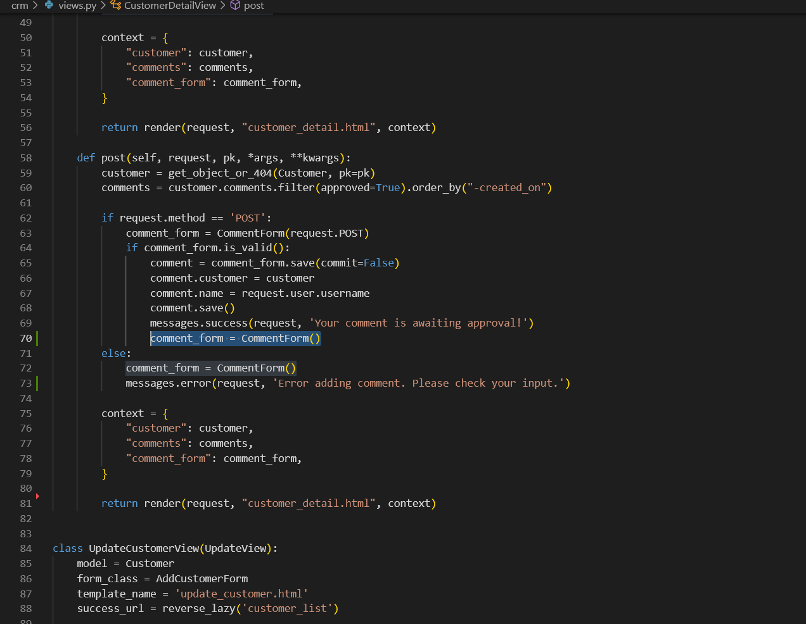
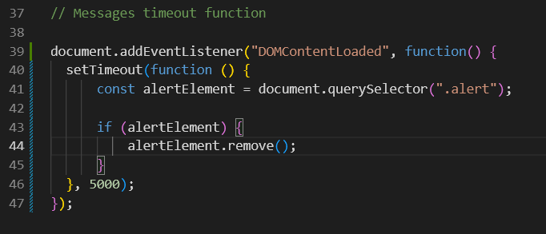

<base target="_blank">

# Alpha CRM | Testing

Return to [README](https://github.com/Freedy-FR/CI-P4-AlphaCRM/blob/main/README.md)

* [Issues](#Issues)
* [PEP8](#PEP8)
* [W3C Validator](#W3C-Validator)
* [Manual Testing](#Manual-Testing)
* [Accessibility](#Accessiblity)
* [Lighthouse Testing](#lighthouse-testing)
* [User Validation Testing](#User-Validation-Testing)

- - -

## Issues

### Solved Bugs

1. Bug: There was an issue with duplicated alert messages being displayed on the user interface.

Solution: After investigating, I found that the messages line was mistakenly placed outside the relevant if statement. Moving it within the conditional block resolved the problem.

Page Before

Page After

 

Code Before

Code After

 

2. Bug: A bug was identified where the comment form was not being reset after submitting a comment, causing the previous comment's content to persist in the form fields.

Solution: To resolve this issue, I added the line comment_form = CommentForm() to the end of the comment's post function. This ensures that the comment form is cleared and reset after successfully submitting a comment.

Page Before

Page After

 

Code Before

Code After

 

3. Bug: An issue was observed where the Profile picture's strong tag was being displayed off-center, affecting the layout and visual alignment.

Solution: To rectify this problem, I enclosed the Profile picture's strong tag within a `
` (paragraph) tag. This adjustment resolved the alignment issue and ensured that the Profile picture displayed correctly within the intended layout.

Page Before

Page After

 

Code Before

Code After

 

4. Bug: An error occurred when the JavaScript query selector couldn't locate the "alert" element, causing a console error.

Solution: To fix this, I added an if statement to confirm the existence of the "alert" element before manipulation, preventing the console error.

Page Before

Page After

 

Code Before

Code After

 

### Known Bugs

To the best of my knowledge below are the known bugs I have identified.

1. Bug: A known issue exists with the profile picture placeholder link, where the link doesn't navigate to the intended destination.

The bug remains unresolved and requires further investigation and troubleshooting to identify the root cause and implement a solution.

Placeholder image

 

- - -

## PEP8 

Testing carried out via [PEP8 Validator](https://pep8ci.herokuapp.com/), all clear, no errors found:
* alphaproject
1. [asgi.py](docs/testing/pep8/pep8-alpha-asgi.png)
2. [settings.py](docs/testing/pep8/pep8-alpha-settings.png)
3. [urls.py](docs/testing/pep8/pep8-alpha-urls.png)
4. [wsgi.py](docs/testing/pep8/pep8-alpha-wsgi.png) 

* crm
1. [admin.py](docs/testing/pep8/pep8-crm-admin.png)
2. [apps.py](docs/testing/pep8/pep8-crm-apps.png)
3. [forms.py](docs/testing/pep8/pep8-crm-forms.png)
4. [models.py](docs/testing/pep8/pep8-crm-models.png)
5. [urls.py](docs/testing/pep8/pep8-crm-urls.png)
6. [views](docs/testing/pep8/pep8-crm-views.png)

- - -

### W3C Validator 
No issues with the HTML pages
CSS validated with direct input to avoid bootstrap classes errors:
* [Home](docs/testing/w3c/w3-home.png)
* [About Me](docs/testing/w3c/w3-about-me.png)
* [Instructions](docs/testing/w3c/w3-instruction.png)
* [Customer List](docs/testing/w3c/w3-customer-list.png)
* [Customer Detail](docs/testing/w3c/w3-customer-detail.png)
* [Customer Update](docs/testing/w3c/w3-customer-update.png)
* [Add Customer](docs/testing/w3c/w3-add-customer.png)
* [CSS](docs/testing/w3c/w3-CSS.png)

- - -

## Manual Testing

* BDD, or Behaviour Driven Development, is the process used to test user stories in a non-technical way, allowing anyone to test the features of an app. User stories as documented in the readme all pass the acceptance criteria set on the Kanban board. So this has been acheived.

* The Website was tested on Samsung internet, Google Chrome, Firefox and Opera browsers. No functionality issues were noted. 

- - -

## Accessibility

[Wave](https://wave.webaim.org/) Web Accessibility Evaluation Tools were used to test accessibility. Please see the results below for each page.

* [Home](docs/testing/wave/wave-home.png)
* [About Me](docs/testing/wave/wave-about.png)
* [Instructions](docs/testing/wave/wave-instructions.png)
* [Customer List](docs/testing/wave/wave-customer-list.png)
* [Customer Detail](docs/testing/wave/wave-customer-detail.png)
* [Customer Update](docs/testing/wave/wave-customer-update.png)
* [Add Customer](docs/testing/wave/wave-customer-add.png)

- - -

## Lighthouse Testing
* [Home](docs/testing/wave/wave-home.png)
* [About Me](docs/testing/wave/wave-about.png)
* [Instructions](docs/testing/wave/wave-instructions.png)
* [Customer List](docs/testing/wave/wave-customer-list.png)
* [Customer Detail](docs/testing/wave/wave-customer-detail.png)
* [Customer Update](docs/testing/wave/wave-customer-update.png)
* [Add Customer](docs/testing/wave/wave-customer-add.png)

- - -

## User Validation Testing

1. If user is not logged in they are unable to access / view "leave a comment" or like button.

2. User input is validated if a logged in user tries to submit an empty comment they see the below message.

3. User input is validated when a user logs out.

4. User input is validated when a user logs in.

5. User input is validated when a user signs up.

6. User input is validated when incomplete forms are submitted for login and sign up.

7. User input is validated when password is too common when signing up or incorrect password when logging in.

8. User input is validated when username is too short, exists already when signing up or incorrect password when logging in.

9. User input is validated when adding a recipe.

10. User input is validated when editing a recipe.

11. User input is validated when deleting a recipe.

12. User input is validated when comment is awaiting approval.

13. User input is validated when comment is liked.

